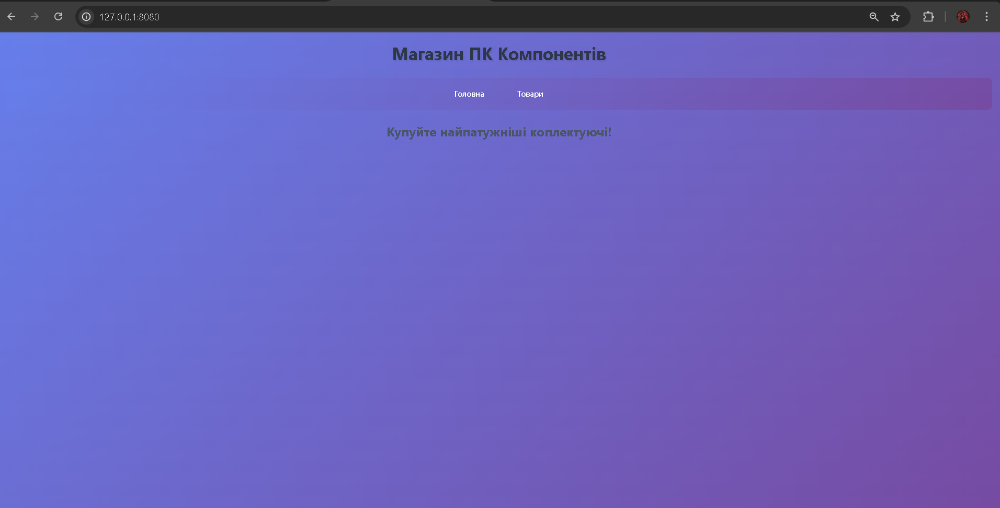
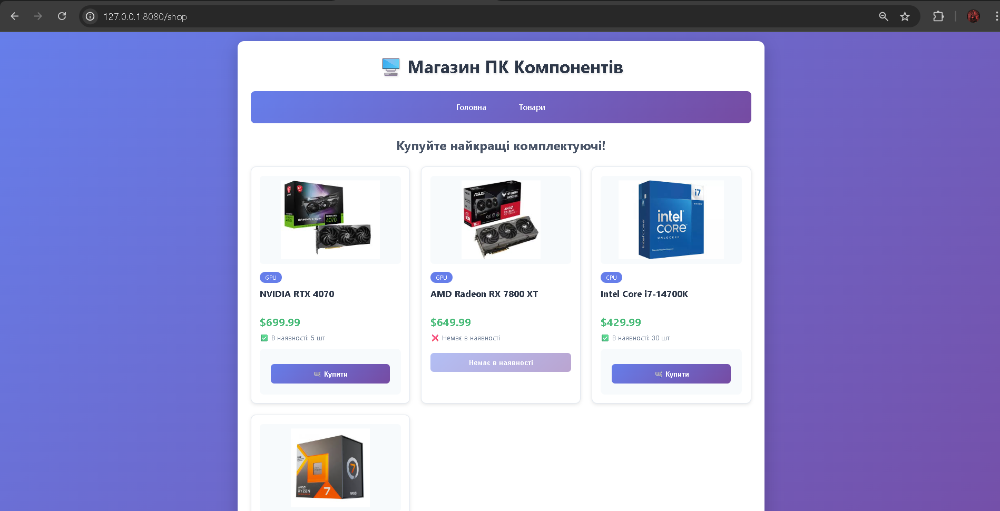
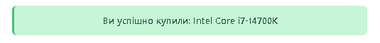
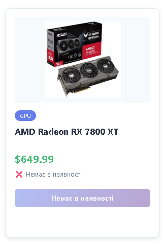
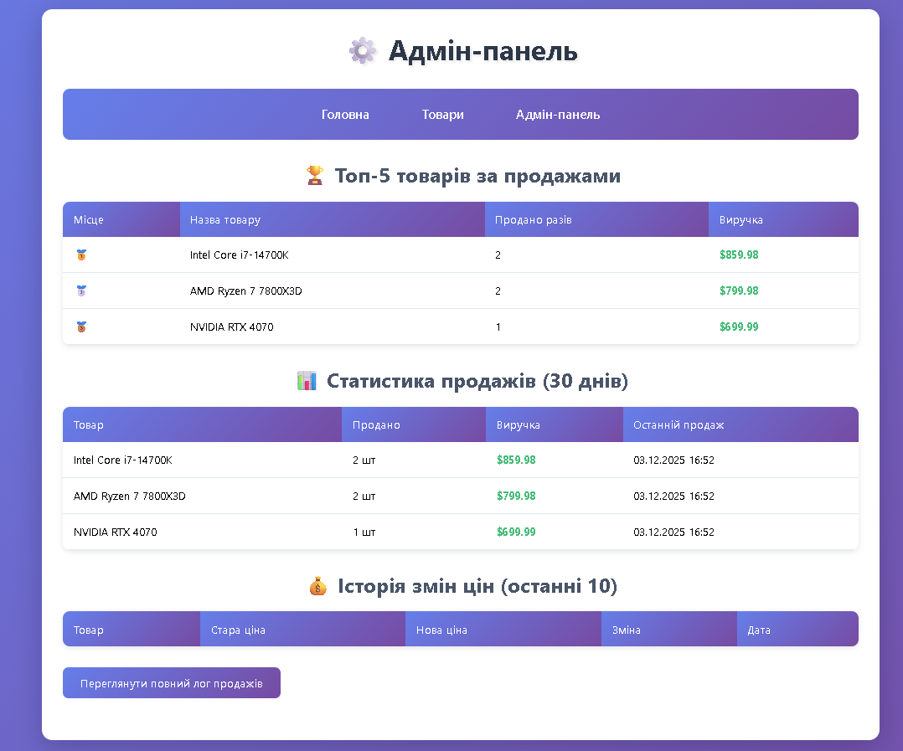
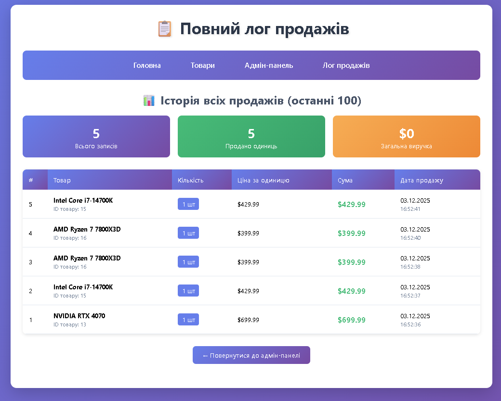
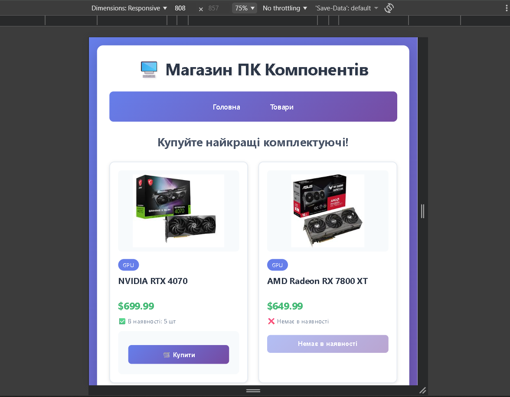

# 🖥️ Магазин ПК Компонентів

Веб-застосунок для онлайн-магазину комп'ютерних компонентів, розроблений на Flask з використанням PostgreSQL.



## 📋 Опис проекту

Це повнофункціональний інтернет-магазин, який дозволяє:
- Переглядати каталог товарів
- Купувати товари з автоматичним оновленням залишків
- Отримувати повідомлення про успішні покупки
- Працювати з сучасним і адаптивним інтерфейсом

## 📸 Скріншоти

### Головна сторінка


### Каталог товарів


### Успішна покупка


### Товар розпроданий


### Адмін-панель


### Лог продажів


### Мобільна версія


## 🚀 Технології

- **Backend**: Flask (Python)
- **База даних**: PostgreSQL
- **Frontend**: HTML5, CSS3, Jinja2
- **Стилізація**: Custom CSS з градієнтами та анімаціями

## 📁 Структура проекту

```
database/
├── screenshots/             # Скріншоти для README
│   ├── home.png            # Головна сторінка
│   ├── shop.png            # Каталог товарів
│   ├── buy.png         # Успішна покупка
│   ├── sold.png        # Розпроданий товар
│   ├── admin.png           # Адмін-панель
│   ├── log.png       # Лог продажів
│   └── mobile.png          # Мобільна версія
├── static/
│   ├── img/                 # Зображення товарів
│   │   ├── 4070.jpg
│   │   ├── rx7800xt.jpg
│   │   ├── i714700k.jpg
│   │   └── ryzen7.jpg
│   └── style.css           # Стилі сайту
├── templates/
│   ├── home.html           # Головна сторінка
│   ├── shop.html           # Каталог товарів
│   ├── browse.html         # Перегляд записів
│   ├── admin.html          # Адмін-панель
│   └── sales_log.html      # Лог продажів
├── main.py                 # Головний файл Flask
├── schema.sql              # Схема бази даних
├── populate.sql            # Тестові дані
├── triggers_and_procedures.sql  # Тригери та процедури
└── README.md               # Документація
```

## ⚙️ Встановлення та налаштування

### Передумови

- Python 3.8+
- PostgreSQL 12+
- pip (менеджер пакетів Python)

### Крок 1: Клонування репозиторію

```bash
git clone <url-репозиторію>
cd database
```

### Крок 2: Встановлення залежностей

```bash
pip install flask psycopg2-binary
```

### Крок 3: Налаштування бази даних

1. Створіть базу даних PostgreSQL:

```sql
CREATE DATABASE practice;
```

2. Оновіть дані підключення в `main.py`:

```python
g.db = psycopg2.connect(
    host="localhost",
    database="practice",
    user="ваш_користувач",
    password="ваш_пароль",
    cursor_factory=RealDictCursor,
)
```

### Крок 4: Ініціалізація бази даних

```bash
flask init      # Створює таблиці
flask populate  # Додає тестові дані
```

Після цього застосуйте тригери та процедури:

```bash
psql -U postgres -d practice -f triggers_and_procedures.sql
```

Або через psql:
```bash
psql -U postgres -d practice
\i triggers_and_procedures.sql
```

### Крок 5: Запуск застосунку

```bash
python main.py
```

Відкрийте браузер та перейдіть за адресою: `http://127.0.0.1:8080`

## 🗄️ Структура бази даних

### Таблиця `products`

| Поле     | Тип           | Опис                    |
|----------|---------------|-------------------------|
| id       | SERIAL        | Первинний ключ          |
| name     | VARCHAR(255)  | Назва товару            |
| category | VARCHAR(100)  | Категорія товару        |
| price    | DECIMAL(10,2) | Ціна товару             |
| quantity | INTEGER       | Кількість на складі     |
| image    | VARCHAR(255)  | Ім'я файлу зображення   |

### Таблиця `entries`

| Поле    | Тип           | Опис                 |
|---------|---------------|----------------------|
| id      | SERIAL        | Первинний ключ       |
| date    | TIMESTAMP     | Дата створення       |
| title   | VARCHAR(255)  | Заголовок            |
| content | TEXT          | Вміст запису         |

### Таблиця `price_history` (для тригерів)

| Поле       | Тип           | Опис                    |
|------------|---------------|-------------------------|
| id         | SERIAL        | Первинний ключ          |
| product_id | INTEGER       | ID товару               |
| old_price  | DECIMAL(10,2) | Стара ціна              |
| new_price  | DECIMAL(10,2) | Нова ціна               |
| changed_at | TIMESTAMP     | Дата зміни              |

### Таблиця `sales_log` (для тригерів)

| Поле          | Тип           | Опис                    |
|---------------|---------------|-------------------------|
| id            | SERIAL        | Первинний ключ          |
| product_id    | INTEGER       | ID товару               |
| product_name  | VARCHAR(255)  | Назва товару            |
| quantity_sold | INTEGER       | Кількість проданих      |
| price_at_sale | DECIMAL(10,2) | Ціна на момент продажу  |
| sale_date     | TIMESTAMP     | Дата продажу            |

### Таблиця `low_stock_alerts` (для тригерів)

| Поле             | Тип           | Опис                    |
|------------------|---------------|-------------------------|
| id               | SERIAL        | Первинний ключ          |
| product_id       | INTEGER       | ID товару               |
| product_name     | VARCHAR(255)  | Назва товару            |
| current_quantity | INTEGER       | Поточна кількість       |
| alert_date       | TIMESTAMP     | Дата сповіщення         |
| is_resolved      | BOOLEAN       | Чи вирішено проблему    |

## 🛣️ Маршрути (Routes)

| Маршрут                      | Метод      | Опис                           |
|------------------------------|------------|--------------------------------|
| `/`                          | GET        | Головна сторінка               |
| `/shop`                      | GET        | Каталог товарів                |
| `/buy/<product_id>`          | POST       | Покупка товару                 |
| `/browse`                    | GET        | Перегляд записів               |
| `/admin`                     | GET        | Адмін-панель                   |
| `/admin/restock/<id>`        | POST       | Поповнення товару              |
| `/admin/discount/<id>`       | POST       | Застосування знижки            |
| `/admin/sales-log`           | GET        | Повний лог продажів            |
| `/testyourself`              | GET        | Тестовий роут                  |
| `/random_number`             | GET        | Генерація випадкового числа    |
| `/dump`                      | GET        | Дамп бази даних                |

## 🔄 Тригери та процедури

### Тригери

1. **trigger_price_change** - Автоматично логує всі зміни цін товарів
2. **trigger_log_sale** - Записує кожен продаж у лог
3. **trigger_low_stock** - Створює сповіщення при низьких залишках (≤2)
4. **trigger_prevent_negative** - Запобігає від'ємним залишкам

### Процедури

1. **restock_product(product_id, quantity)** - Поповнення залишків товару
   ```sql
   SELECT restock_product(1, 10);
   ```

2. **apply_discount(product_id, discount_percent)** - Застосування знижки
   ```sql
   SELECT apply_discount(1, 15);
   ```

3. **get_sales_stats(days)** - Статистика продажів за період
   ```sql
   SELECT * FROM get_sales_stats(30);
   ```

4. **get_top_products(limit)** - Топ найпопулярніших товарів
   ```sql
   SELECT * FROM get_top_products(5);
   ```

## 🎨 Особливості дизайну


- **Градієнтний фон**: Фіолетово-синій градієнт для сучасного вигляду
- **Адаптивна сітка**: Автоматичне підлаштування під різні розміри екранів
- **Анімації**: Плавні переходи та ефекти наведення
- **Flash повідомлення**: Сповіщення про успішні/неуспішні операції
- **Картки товарів**: Стильні картки з тінями та ефектами hover

## 🔧 Команди Flask CLI

```bash
flask init      # Ініціалізація БД (створення таблиць)
flask populate  # Заповнення тестовими даними
```

## 📝 Приклади використання

### Робота з процедурами через Python

```python
from flask import Flask
import psycopg2

# Поповнення товару
conn = get_db()
cur = conn.cursor()
cur.execute("SELECT restock_product(%s, %s)", (1, 10))
result = cur.fetchone()
print(result[0])  # "Успішно! NVIDIA RTX 4070: було 5, стало 15 (+10)"

# Застосування знижки
cur.execute("SELECT apply_discount(%s, %s)", (1, 20))
result = cur.fetchone()
print(result[0])  # "Знижка 20% на "NVIDIA RTX 4070": 24999.99 грн → 19999.99 грн"
```

### Перегляд логів через SQL

```sql
-- Історія цін
SELECT * FROM price_history ORDER BY changed_at DESC;

-- Лог продажів
SELECT * FROM sales_log ORDER BY sale_date DESC;

-- Активні сповіщення про низькі залишки
SELECT * FROM low_stock_alerts WHERE is_resolved = FALSE;

-- Статистика за тиждень
SELECT * FROM get_sales_stats(7);

-- Топ-3 товари
SELECT * FROM get_top_products(3);
```

## 📊 Адмін-панель

Адмін-панель доступна за адресою `/admin` і надає:


### Основні функції:
- 📉 **Сповіщення про низькі залишки** - автоматичні алерти коли товару ≤2 шт
  - Можливість швидкого поповнення прямо з панелі
  - Автоматичне закриття алертів після поповнення
- 🏆 **Топ-5 найпопулярніших товарів** - рейтинг за кількістю продажів
  - Відображення місця (🥇🥈🥉)
  - Загальна виручка по кожному товару
- 📈 **Статистика продажів за 30 днів** - детальна аналітика
  - Кількість проданих одиниць
  - Сума виручки
  - Дата останнього продажу
- 💰 **Історія змін цін** - останні 10 змін
  - Порівняння старої та нової ціни
  - Візуалізація збільшення/зменшення
  - Точна дата зміни
- 🛠️ **Швидкий доступ до управління** - посилання на повний лог продажів

### Лог продажів

Окрема сторінка `/admin/sales-log` показує детальну історію:


**Що включає:**
- Статистичні картки (всього записів, продано одиниць, загальна виручка)
- Детальна таблиця з усіма продажами
- Інформація про кожен продаж: ID, товар, кількість, ціна, сума, дата/час
- Автоматичний розрахунок сум та статистики

## 🐛 Відладка

Якщо виникають проблеми:

1. **Товари не відображаються**:
   - Перевірте підключення до БД
   - Запустіть `flask populate`
   - Перевірте консоль браузера (F12)

2. **Помилка підключення до PostgreSQL**:
   - Переконайтесь, що PostgreSQL запущений
   - Перевірте дані для входу
   - Переконайтесь, що база даних створена

3. **Зображення не завантажуються**:
   - Перевірте наявність файлів у папці `static/img/`
   - Переконайтесь, що імена файлів відповідають БД

4. **Тригери не спрацьовують**:
   - Переконайтесь, що файл `triggers_and_procedures.sql` був застосований
   - Перевірте чи створені додаткові таблиці (`price_history`, `sales_log`, `low_stock_alerts`)
   - Перегляньте логи PostgreSQL

5. **Адмін-панель не працює**:
   - Переконайтесь, що додали нові роути до `main.py`
   - Перевірте наявність шаблонів `admin.html` та `sales_log.html`
   - Переконайтесь, що процедури створені в БД

---

## 📸 Список скріншотів для README

Для повної документації проекту рекомендується зробити наступні скріншоти:

### Обов'язкові:
1. **home.png** - Головна сторінка (перше враження)
2. **shop.png** - Каталог товарів з картками
3. **admin.png** - Адмін-панель з усіма розділами
4. **sales-log.png** - Сторінка логу продажів зі статистикою

### Додаткові:
5. **success.png** - Flash-повідомлення після успішної покупки (зелене)
6. **sold-out.png** - Flash-повідомлення коли товар закінчився (червоне)
7. **mobile.png** - Мобільна версія (зменшіть вікно або DevTools F12)

### Опціональні:
8. **hover-effect.png** - Товар з ефектом наведення
9. **low-stock-alert.png** - Сповіщення про низькі залишки в адмінці
10. **price-history.png** - Розділ з історією цін

**Як зробити скріншоти:**
- Використовуйте `Win + Shift + S` (Windows) або `Cmd + Shift + 4` (Mac)
- Або скористайтесь розширенням для браузера (Awesome Screenshot, Nimbus)
- Збережіть у папку `screenshots/` з відповідними іменами

---

## 🔐 Безпека

⚠️ **ВАЖЛИВО**: Перед розгортанням на продакшені:

- Змініть `app.secret_key` на складний випадковий рядок
- Не зберігайте паролі БД у коді (використовуйте змінні оточення)
- Додайте HTTPS
- Налаштуйте правильні права доступу до БД

## 📊 Майбутні покращення

- [ ] Система авторизації користувачів
- [ ] Кошик покупок
- [ ] Фільтрація товарів за категоріями
- [ ] Пошук товарів
- [x] Адмін-панель для управління товарами
- [x] Історія покупок через тригери
- [ ] API для мобільного додатку
- [x] Автоматичні сповіщення про низькі залишки
- [x] Статистика продажів
- [ ] Система знижок та промокодів

## 👤 Developed by and why

Проект розроблено для практичного навчання веб-розробці by Serhii

## 📄 Ліцензія

Цей проект створено в освітніх цілях

## 🤝 Внесок

Якщо ви знайшли баг або маєте ідеї для покращення:
1. Створіть Issue
2. Зробіть Fork репозиторію
3. Створіть Pull Request
